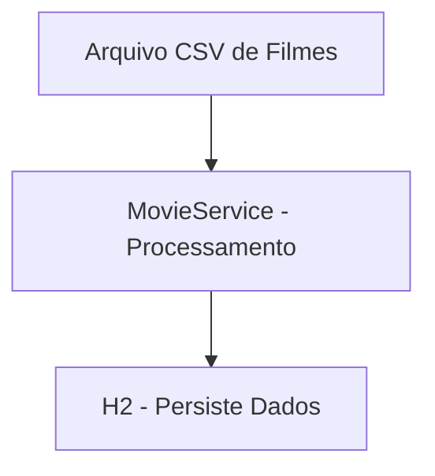
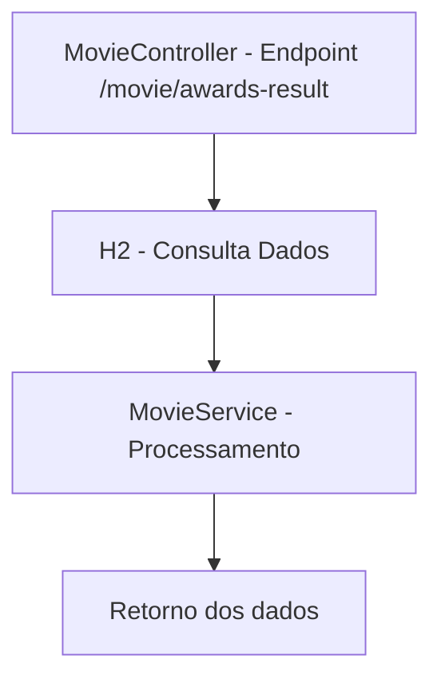

# 🎬 Movie API

API reativa desenvolvida com **Spring Boot 3** e **Spring WebFlux**, que processa dados de filmes e retorna informações
sobre prêmios consecutivos de produtores.  
A documentação interativa é gerada automaticamente com **Springdoc OpenAPI** (Swagger UI).

---

## 🚀 Tecnologias Utilizadas

- **Java 17+**
- **Spring Boot 3**
- **Spring WebFlux**
- **Springdoc OpenAPI** (Swagger UI)
- **Reactor** (programação reativa)
- **Lombok** (para reduzir boilerplate)
- **Leitura de CSV** para dados de filmes

---

## 📂 Estrutura Principal do Projeto

```
src/main/java/br/outsera/movies
 ├── Application.java          # Classe principal
 ├── config/OpenApiConfig.java # Configuração do Swagger/OpenAPI
 ├── controller/MovieController.java # Endpoints REST
 ├── model/                    # DTOs e entidades
 ├── repository/               # Acesso a dados
 └── service/MovieService.java # Lógica de negócios
```

---

## 📦 Dependências Principais (Gradle Kotlin DSL)

```kotlin
implementation("org.springframework.boot:spring-boot-starter-webflux")
implementation("org.springdoc:springdoc-openapi-starter-webflux-ui:2.6.0")
implementation("org.projectlombok:lombok")
annotationProcessor("org.projectlombok:lombok")
```

---

## 🖥️ Como Executar Localmente

### 1️⃣ Pré-requisitos

- **Java 17** ou superior
- **Gradle** (opcional, use o wrapper incluído no projeto)
- **Git** instalado

### 2️⃣ Clonar o repositório

```bash
git clone https://github.com/heltonpitz/movie-api.git
cd movie-api
```

### 3️⃣ Executar a aplicação

Usando o *Gradle Wrapper*:

```bash
./gradlew bootRun
```

Ou compilando e executando:

```bash
./gradlew build
java -jar build/libs/movie-api-*.jar
```

---

## 🌐 Endpoints da API

Endereço swagger: http://localhost:8080/swagger-ui.html

| Método | Endpoint               | Descrição                                                                               |
|--------|------------------------|-----------------------------------------------------------------------------------------|
| GET    | `/movie/awards-result` | Retorna um objeto com o produtor com menor e maior intervalo entre prêmios consecutivos |

---

## 📄 Exemplo de Resposta (`GET /movie/awards-result`)

```json
{
  "min": [
    {
      "producer": "Producer A",
      "interval": 1,
      "previousWin": 2000,
      "followingWin": 2001
    }
  ],
  "max": [
    {
      "producer": "Producer B",
      "interval": 13,
      "previousWin": 1990,
      "followingWin": 2003
    }
  ]
}
```

---

## 🔄 Fluxo da Aplicação

Fluxo inicial (Inicialização do banco em
memória) - [StartupRunner.java](src%2Fmain%2Fjava%2Fbr%2Foutsera%2Fmovies%2FStartupRunner.java)


Fluxo de consulta do
Resultado - [MovieController.java](src%2Fmain%2Fjava%2Fbr%2Foutsera%2Fmovies%2Fcontroller%2FMovieController.java)


